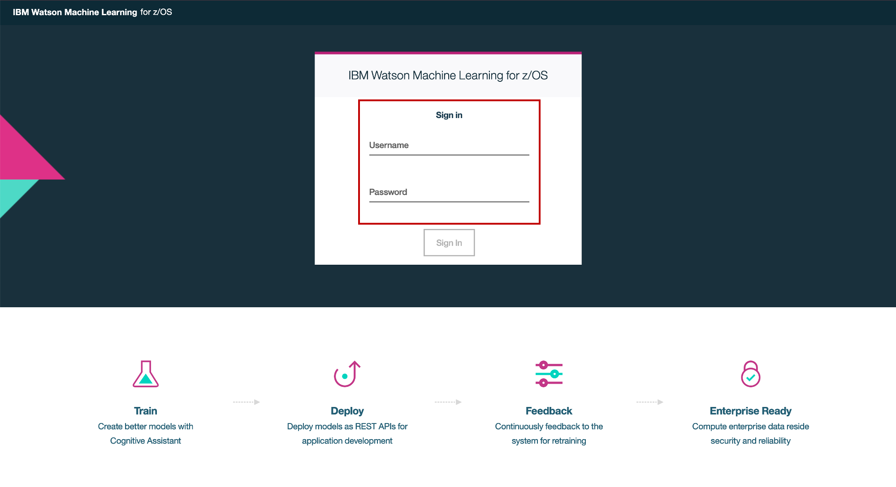
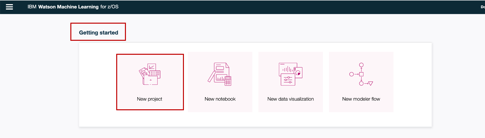
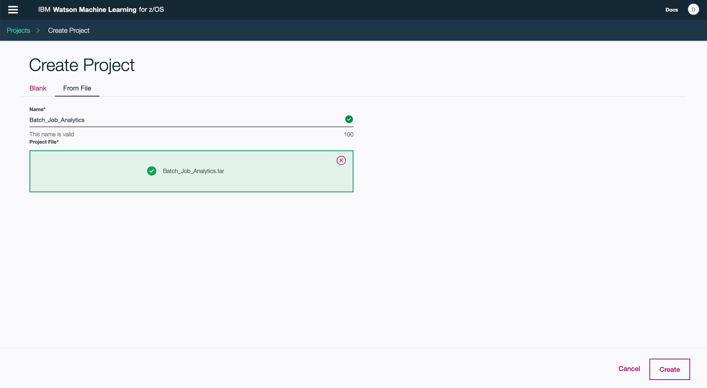
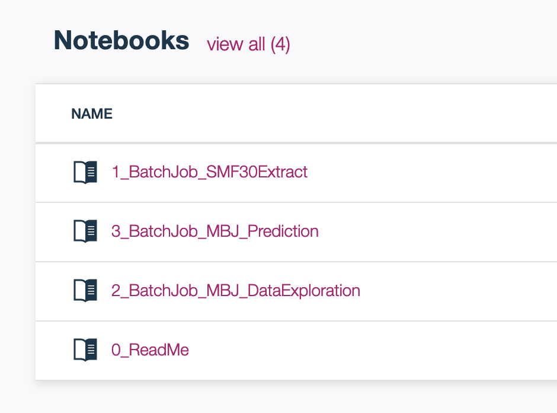
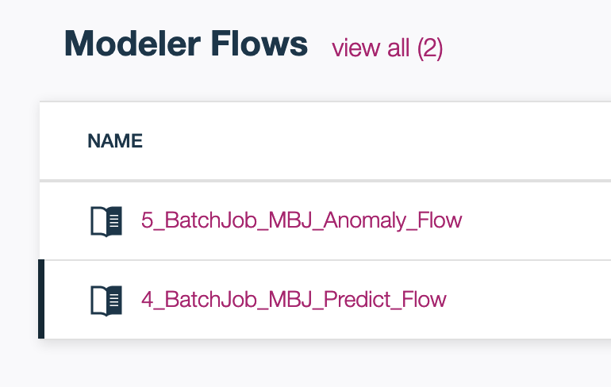
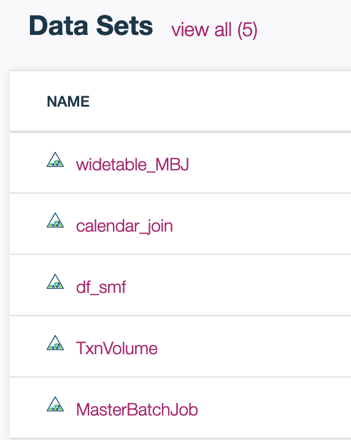

# Short title
 
Analyze batch job on mainframe with machine learning

# Long title

Analyze batch job on IBM mainframe via Watson Machine Learning on z/OS

# Author

* Ling Zhuo <zhuoling@cn.ibm.com>
* Guanjun Cai <gcai@us.ibm.com>
* Ying Cao <caoyingc@cn.ibm.com>

# URLs

### Github repo

* https://github.ibm.com/IBM/analyze-batch-job-z

# Summary

The pattern demonstrate how to analyze batch job on mainframe with Watson Machine Learning on z/OS. Including to ingest batch job run time data from SMF Type 30 record, explore periodicity and correlation, predict elapsed time and detect anomaly, you needs IBM Watson Machine Learning for z/OS to finish this code pattern.

# Technologies

* Analytics
* Machine Learning on z/OS

# Description

Running batch job is critical operation on mainframe. Everyday there are 10000~60000 jobs running at day and night. During begin or end day of month/quarter/year, the workload may reach twice of regular days. It is demanded to operate mainframe in a optimal status with high productive and sufficient to business demand.

You can use WMLz to analyze your batch processing and extract insights to enhance the following aspects of your batch operation:

* Trend and seasonality of batch job's elapsed time according to workload change.
* Impact of transactions and other business operations on batch job elapsed time.
* Prediction of elapsed time of long-running jobs.
* Identification of potentially abnormal job instances as well as transaction volumes.

# Flow

<!--add an image in this path-->

1. You could work on WMLz(IBM Watson Machine Learning for z/OS) through web browser.
2. WMLz provides Jupyter Notebook for you to code in Python and R.
3. WMLz provides Modeler Flow for you to explore data and train model in canvas by drop and down.
4. You could read mainframe native file such as SMF Type 30 record with Python notebook based on mainframe data service included in WMLz.

# Instructions

1. Download .zip (for Windows or Mac) or .tar.gz (for Linux) file in folder of "ProjectZIP" to your computer

2. Login to WMLz in your enterprise WMLz URL, with your username and password.
<!--add an image in this path-->

3. Click on "New Project" in "Getting started"
<!--add an image in this path-->

4. Select tab of "from file", browse in your computer and select the file you downloaded in step 1, click "OK"
<!--add an image in this path-->

5. Check the added new project, it should includes 4 notebooks,2 flows and 5 datasets.
<!--add an image in this path-->

# Components and services

* IBM Watson Machine Learning on z/OS server
* IBM Mainframe Data Service on z/OS server

# Runtimes

* Web Browser
* python

# Related IBM Developer content

# Related links
<a href="https://www.ibm.com/us-en/marketplace/machine-learning-for-zos">IBM Watson Machine Learning for z/OS </a>

<a href="http://www.redbooks.ibm.com/abstracts/sg248421.html?Open">Turning Data into Insight with IBM Machine Learning for z/OS </a>

<a href="https://www.ibm.com/support/knowledgecenter/zosbasics/com.ibm.zos.zmainframe/zconc_batchproc.htm">Mainframes working after hours: Batch processing </a>

<a href="https://en.wikipedia.org/wiki/IBM_System_Management_Facilities">IBM System Management Facilities </a>

<a href="https://www.ibm.com/support/knowledgecenter/en/SSLTBW_2.3.0/com.ibm.zos.v2r3.ieag200/rec30.htm">IBM SMF Type 30 record </a>

There are several real client use cases on mainframe batch job analytics, you are welcome to email to author(zhuoling@cn.ibm.com) for further discussion. 
