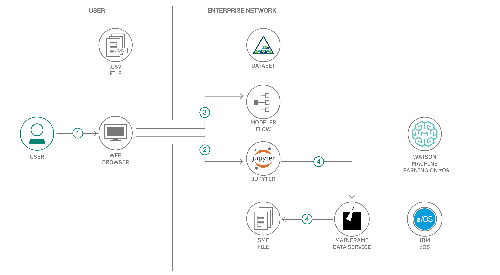

<!-- Put badges at the very top -->
<!-- Change the repo -->
<!-- 

<!-- Add a new Title and fill in the blanks -->

# Analyze Batch Job via IBM Watson Machine Learning on z/OS

Running batch jobs is critical to the effective operation of a mainframe. Every day, a typical mainframe might have 10,000 – 60,000 jobs running day and night. And on days that fall at the beginning or end of a month, quarter, or year, workloads can be as much as twice that size. Effective batch processing is critical to maintaining the high productivity demands of many businesses today.

You can use IBM® Watson™ Machine Learning for z/OS to analyze your batch processing and extract insights to enhance the following aspects of your batch operation:

* Trend and seasonality of batch jobs’ elapsed time according to workload change
* Impact of transactions and other business operations on the elapsed time of batch jobs
* Prediction of elapsed time for long-running jobs
* Identification of potentially abnormal job instances and transaction volumes

In this code pattern, we show you some analytics samples of a Master Batch Job for a fictional bank (BankABC) by using Python Notebooks and Modeler Flow, based on customized sample data, and validated as workable on IBM Watson Machine Learning on z/OS V2.1.
   
   > BankABC wants to analyze the elapsed time of the Master Batch Job (MBJ). MBJ is a big application that runs every day at midnight, and includes over 10,000 jobs and covers various types of business transactions. 
   BankABC wants to know how the MBJ elapsed time changes, which factors have the greatest impact, what is the correlation among daily business transaction volumes and elapsed time. 
   Additionally, BankABC wants to know if the MBJ elapsed time is predictable. Usually MBJ runs for 2 - 5 hours starting at midnight, so BankABC wants to make sure it completes before office hours begin the next morning. A reasonable predition can help to arrange MBJ and maintenance jobs productively, and is useful for anomaly detection.  

When you complete this sample project, you will understand how to:

* Extract batch job operation data from SMF type 30 records
* Explore log data to get insights about batch job elapsed time 
* Use several algorithms to predict batch job elapsed time 
* Identify candidates of abnormal batch job instances and business transaction volume
  
## Architecture

<!--add an image in this path-->

### Highlights

1. You can use IBM Watson Machine Learning for z/OS through a web browser.
2. Watson Machine Learning provides Jupyter Notebooks so you can code in Python and Scala.
3. Watson Machine Learning provides Modeler Flow so you can explore data and train models in canvas by drop-down.
4. You can read z/OS data sets -- for example, SMF type 30 records in a Python notebook with a mainframe data service.

## What is included ?
   **There are 5 important folders in the project**
   
   ### Data
    1. df_smf.csv
       Sample output of 1_BatchJob_SMF30Extract.ipynb, which is batch job run time metrics, the most important data input for later batch job analytics.
       In the z/OS operation log, SMF provides a common interface to extract system operation measurements. SMF Type 30 includes records of batch job operation. 
       In real client environments, such data could be also collected by other third-party software.

    2. MasterBatchJob.csv
       Elapsed time of MBJ in one year, sample data simulated for demo.
       The elapsed time of MBJ is measured as the number of minutes between the start time of first job in MBJ and the end time of last job in MBJ; it can be calculated from df_smf.csv.

    3. TxnVolume.csv
       Transaction volumes of various business types in one year, sample data simulated for demo.   

    4. calendar_join.csv
       Calendar data with calendar elements like weekday, day, month, etc.

    5. widetable_MBJ.csv
       A joined wide table of MBJ elapsed time, transaction volumes, and calendar data, ready for model training for 3_BatchJob_MBJ_Prediction.ipynb.
    
   
   ### Notebook 
    This includes the source code of 4 Python notebooks. You can open them in the Jupyter web environment and run them one-by-one following the instruction inside the notebook.
   
    0_readme.ipynb
      This notebook provides an overview of the sample project.

    1_BatchJob_SMF30Extract.ipynb
      This notebook extracts batch job operation data from SMF data set with type 30 records. You can modify SQL statements in the notebook to extract the information that you’re interested in.
 
      Please refer to the IBM Knowledge Center about SMF type 30 records to find out more about mainframe job metrics definition according to your z/OS version.
      SMF data set with one year SMF30 data is too large to fit in a sample project so only the output from this notebook - df_smf.csv is included for your information.

    2_BatchJob_MBJ_DataExploration.ipynb
      This notebook explores MBJ's elapsed time to get insights on trends in timeline, correlation to daytime business volumes and periodicity on week/day/month.

    3_BatchJob_MBJ_Prediction.ipynb
      This notebook applies 3 methods to predict MBJ elapsed time based on historical data, calendar information, and business transaction volume data, and then emsembles them as final results.

    **Note:** In the notebook cell, when reading local dataset on Watson Machine Learning for z/OS, you will need a token for authetication, the expiration period is configurated by adminitrator, when you run cell failed and error message shows that token expired, please click on top right button to get a new up-to-date token to replace the old project context.
  
  ### Flow
    This project has 2 flows which you need to open in Watson Machine Learning for z/OS.
    
    4_BatchJob_MBJ_TSPredict.str
      This flow applies a time series algorithm to predict elapsed time.
      
    5_BatchJob_MBJ_AnomalyDetect.str
      This flow detects anomalies in elapsed time and business transaction volumes.
      

  ### ProjectZIP
    2 zip files with same content, BatchJobAnalytics.zip and BatchJobAnalytics.tar.gz, used for Windows/Mac and Linux, respectively.
    In a web browser with IBM Waston Machine Learning for z/OS, you can "Add Project" from file with the zip file. This will add a new project with the previous Python notebooks and all datasets at one time. And then you can explore the sample project as you like.
  
  ### View
    Before you run and explore the demo process of analytics, you can easily find the demo output here:  
    4 read-only views of HTML files, with output results of Python notebooks are included.
    4 screenshots from flow output, with predicted results and abnormal records detected.

## Steps to import this project to WMLz

1. Download the .zip (for Windows or Mac) or .tar.gz (for Linux) file in the "ProjectZIP" folder to your computer.
2. Login to Watson Machine Learning for z/OS in your enterprise Watson Machine Learning for z/OS URL, with your username and password.
3. Select "Projects" in the left menu pallete, click on "Create New Project."
4. Select the "Add from file" tab, browse in your computer and select the file you downloaded in step 1, then click "OK."
5. Check to see that the new project has been added; it should includes 4 notebooks, 2 flows, and 5 data sets.

<!-- keep this -->
## License

This code pattern is licensed under the Apache License, Version 2. Separate third-party code objects invoked within this code pattern are licensed by their respective providers pursuant to their own separate licenses. Contributions are subject to the [Developer Certificate of Origin, Version 1.1](https://developercertificate.org/) and the [Apache License, Version 2](https://www.apache.org/licenses/LICENSE-2.0.txt).

[Apache License FAQ](https://www.apache.org/foundation/license-faq.html#WhatDoesItMEAN)
